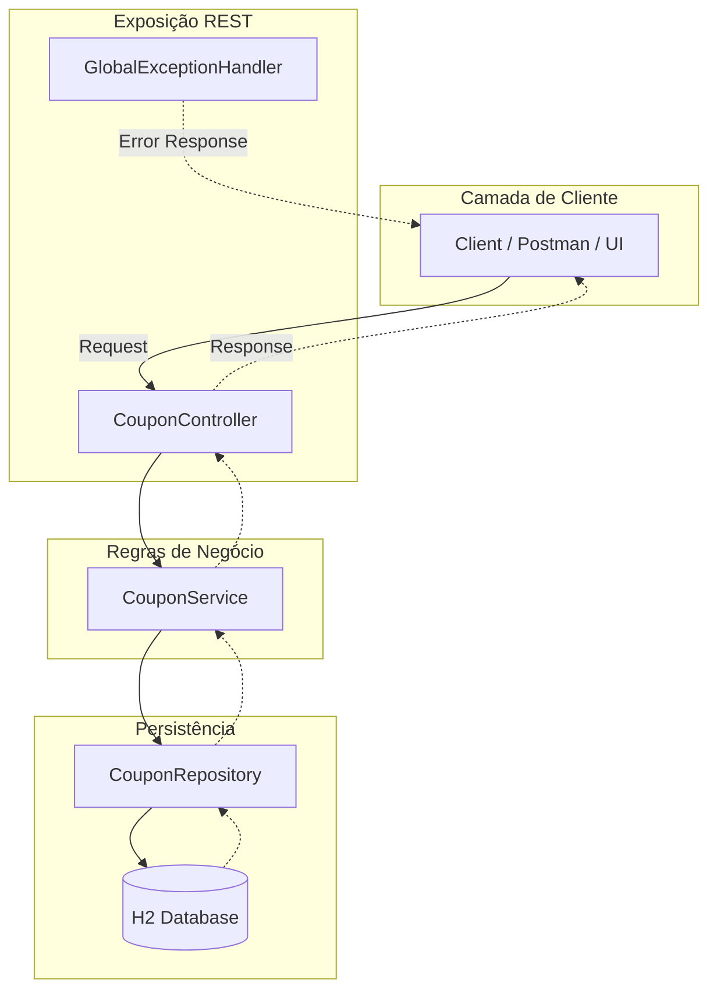
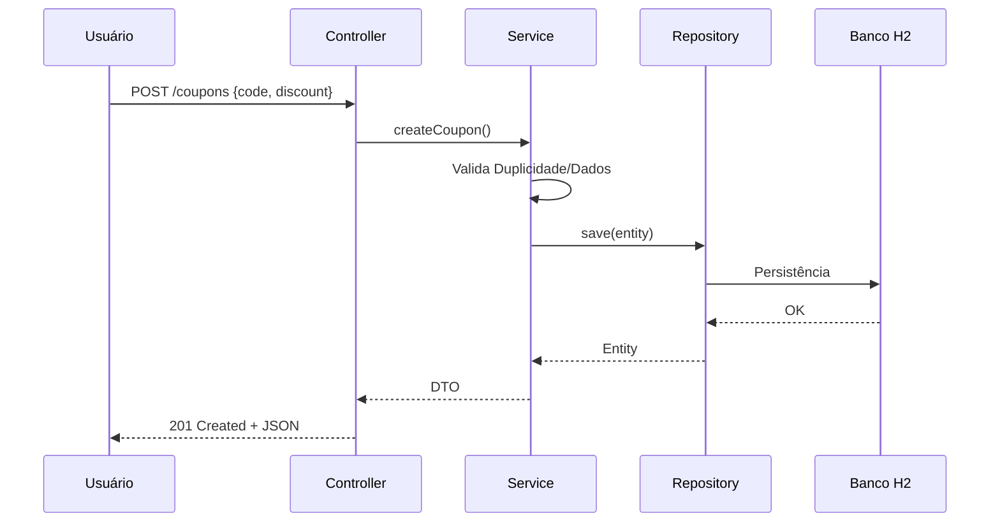
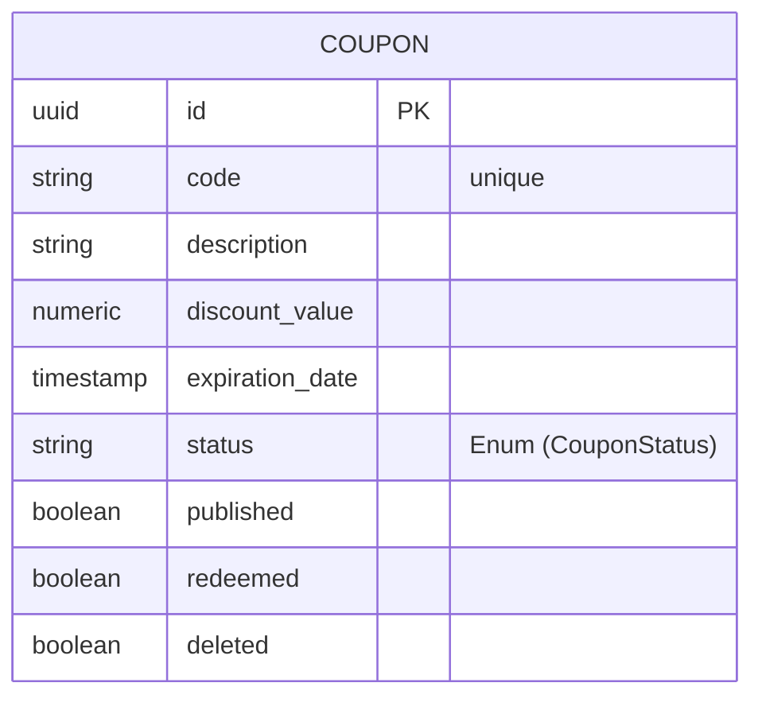

# 🧠 OneBrain – Gerenciador de Cupons


## 🎯 Objetivo da API

O OneBrain Coupon Manager é uma API REST projetada para gerenciar cupons de desconto de forma simples, segura e escalável.

A solução permite que sistemas de e-commerce, plataformas digitais ou aplicações promocionais criem, consultem e controlem cupons com facilidade, garantindo controle de validade, status e utilização dos cupons.

A API foi construída para ser fácil de integrar em diferentes aplicações, fornecendo endpoints claros para criação, consulta e gerenciamento do ciclo de vida dos cupons.

## 👥 Para quem esta API é destinada

**Esta API é ideal para:**

Plataformas de e-commerce que precisam aplicar descontos promocionais

Sistemas de fidelidade ou campanhas de marketing

Aplicações SaaS que desejam oferecer cupons para seus usuários

Desenvolvedores backend que precisam integrar rapidamente um sistema de cupons

## 📋 Sobre o Projeto

A aplicação foi construída seguindo boas práticas modernas de desenvolvimento backend:

Arquitetura em camadas para melhor organização e manutenção do código

Tratamento global de exceções com respostas padronizadas

Validação de dados para garantir integridade das informações

Testes automatizados utilizando JUnit e Mockito

## 🔌 API Overview

A API fornece endpoints para gerenciamento de cupons, permitindo criação, consulta e remoção.

### Principais rotas

| Método | Endpoint | Descrição |
|------|------|------|
| POST | `/coupons` | Cria um novo cupom |
| GET | `/coupons/{id}` | Busca um cupom pelo ID |
| DELETE | `/coupons/{id}` | Remove um cupom |

---

## 📚 Documentação da API

A documentação completa da API está disponível através do **Swagger UI**, onde é possível visualizar todos os endpoints, parâmetros e exemplos de requisição.

Após iniciar a aplicação, acesse:
http://localhost:8080/swagger-ui.html


## 🏗️ Arquitetura do Sistema

A arquitetura segue o padrão **Controller → Service → Repository**. Abaixo, o fluxo de comunicação entre os componentes:



### 🛠️ Exemplo de Payload (POST)
```json
{
    "code": "C1236a",
    "description": "Iure saepe amet. Excepturi saepe inventore nam doloremque voluptatem a. Quaerat odio distinctio eos",
    "discountValue": 0.8,
    "expirationDate": "2025-11-04T17:14:45.180Z",
    "published": "false"
}
```
## 🔄 Fluxo de Criação (Sequence Diagram)


## 🗄️ Persistência e Acesso



### 📝 Notas sobre o mapeamento:

* PK (Primary Key): Identificado pelo seu @Id (UUID).

* **Tipos de Dados:**
* **BigDecimal** mapeia para numeric ou decimal.
* **Instant mapeia** para timestamp.
* **CouponStatus** armazenado como string (VARCHAR) no H2/JPA.
* **Colunas Customizadas:** Note que usei discount_value e expiration_date conforme definido nas suas anotações @Column(name = "...").

A aplicação utiliza o banco de dados H2 (em memória) para facilitar o desenvolvimento.
API Base URL: http://localhost:8080

Console do Banco: http://localhost:8080/h2-console

Para configurações do Console H2 vide application-example.properties

## 🛠️ Tecnologias e Ferramentas

* **Linguagem:** Java 17 LTS
* **Framework:** Spring Boot 3.x
* **Dados:** Spring Data JPA & H2 Database
* **Build:** Maven
* **Testes:** JUnit 5, Mockito, WebMVC Test

## 🚀 Guia de Execução

1️⃣ Pré-requisitos:

* Docker e Docker Compose instalados.
* Git para clonar o repositório.

2️⃣ Instalação, Build e Execução:

Abra o seu terminal e execute:

```bash
# 1. Clone o repositório
git clone https://github.com/GibsonCS/onebrain.git

# 2. Entre na pasta do projeto
cd onebrain

# 3. Build e Execução (em segundo plano)
docker-compose up -d --build
```

## Test Coverage

O projeto utiliza **JaCoCo** para análise de cobertura de testes.

Para gerar o relatório:

```bash
mvn clean verify
```
O relatório será gerado em:

target/site/jacoco/index.html

Develop by: **GibsonCS**

#### 📅 Última atualização: Março de 2026
