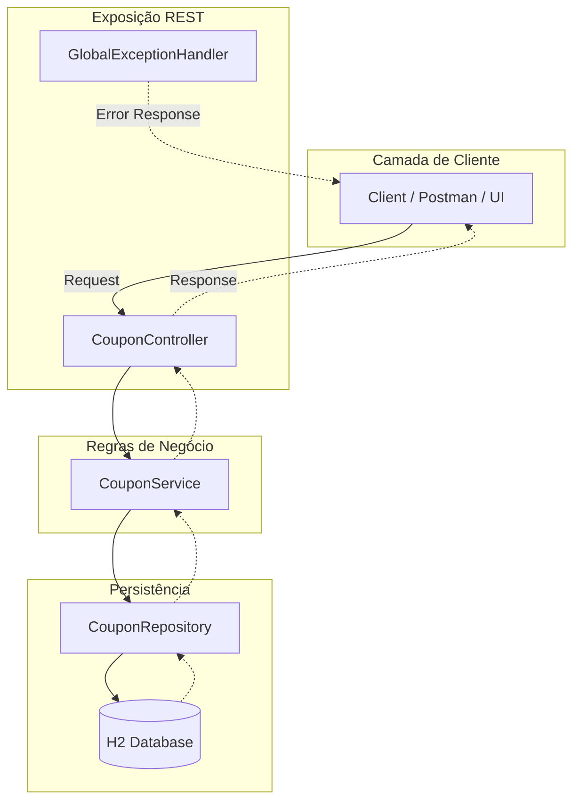
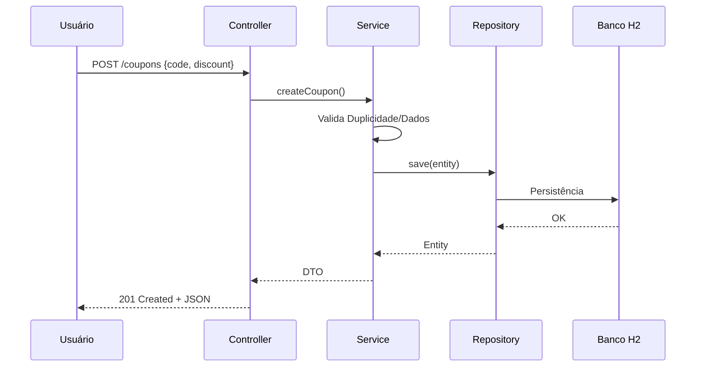
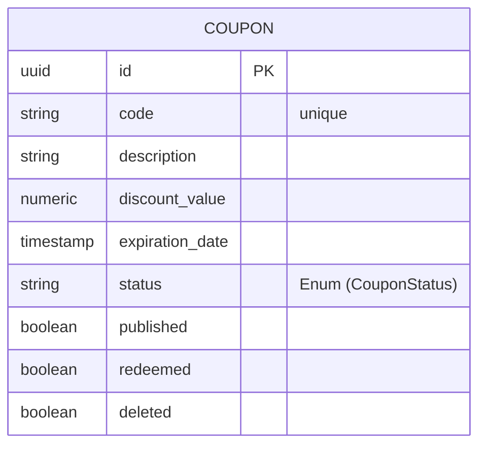

# 🧠 OneBrain – Gerenciador de Cupons


O **OneBrain Coupon Manager** é uma API REST robusta desenvolvida em Java com Spring Boot. A aplicação oferece uma solução escalável para a gestão de cupons de desconto, focando em organização de código e performance.

## 📋 Sobre o Projeto

A aplicação foi construída seguindo rigorosas boas práticas de desenvolvimento backend:
* **Separação de Camadas:** Responsabilidades bem definidas.
* **Tratamento Global de Exceções:** Respostas de erro padronizadas.
* **Validação de Dados:** Garantia de integridade das informações.
* **Testes Automatizados:** Cobertura com JUnit e Mockito.

---

## 🏗️ Arquitetura do Sistema

A arquitetura segue o padrão **Controller → Service → Repository**. Abaixo, o fluxo de comunicação entre os componentes:



## 🔌 API Endpoints

Abaixo estão as rotas disponíveis na aplicação. Você pode testá-las usando ferramentas como **Postman**, **Insomnia** ou **cURL**.

| Método | Endpoint | Ação | Status Sucesso |
| :--- | :--- | :--- | :--- |
|  | `/coupons` | Cadastra um novo cupom | `201 Created` |
|  | `/coupons/{id}` | Recupera detalhes por ID | `200 OK` |
|  | `/coupons/{id}` | Remove um cupom (Soft Delete) | `204 No Content` |

### 🛠️ Exemplo de Payload (POST)
```json
{
    "code": "C1236a",
    "description": "Iure saepe amet. Excepturi saepe inventore nam doloremque voluptatem a. Quaerat odio distinctio eos",
    "discountValue": 0.8,
    "expirationDate": "2025-11-04T17:14:45.180Z",
    "published": "false"
}
```
## 🔄 Fluxo de Criação (Sequence Diagram)



## 🛠️ Tecnologias e Ferramentas

* **Linguagem:** Java 17 LTS
* **Framework:** Spring Boot 3.x
* **Dados:** Spring Data JPA & H2 Database
* **Build:** Maven
* **Testes:** JUnit 5, Mockito, WebMVC Test

## 🚀 Como Executar

### Pré-requisitos:
* Java 17 instalado.
* Maven configurado no PATH.

## 🚀 Guia de Execução

Siga os passos abaixo para rodar o projeto localmente em menos de 2 minutos.

### 1️⃣ Pré-requisitos
* **Java 17** (ou superior)
* **Maven 3.8+**
* **Git**

### 2️⃣ Instalação, Build e Execução
Abra o seu terminal e execute:

```bash
# Clone o repositório
git clone https://github.com/GibsonCS/onebrain.git

# Entre na pasta
cd onebrain

# Limpe e compile o projeto (gera o arquivo .jar)
mvn clean package

# Execute o artefato gerado
java -jar target/onebrain-0.0.1-SNAPSHOT.jar
```

## 🗄️ Persistência e Acesso



### 📝 Notas sobre o mapeamento:

* PK (Primary Key): Identificado pelo seu @Id (UUID).

* **Tipos de Dados:**
* **BigDecimal** mapeia para numeric ou decimal.
* **Instant mapeia** para timestamp.
* **CouponStatus** armazenado como string (VARCHAR) no H2/JPA.
* **Colunas Customizadas:** Note que usei discount_value e expiration_date conforme definido nas suas anotações @Column(name = "...").

A aplicação utiliza o banco de dados H2 (em memória) para facilitar o desenvolvimento.
API Base URL: http://localhost:8080

Console do Banco: http://localhost:8080/h2-console

Para configurações do Console H2 vide application-example.properties

## 🧪 Qualidade de Código (Testes)
Para rodar a suíte de testes unitários e de integração, utilize:

```bash
mvn test
```

Develop by: **GibsonCS**

#### 📅 Última atualização: Março de 2026
